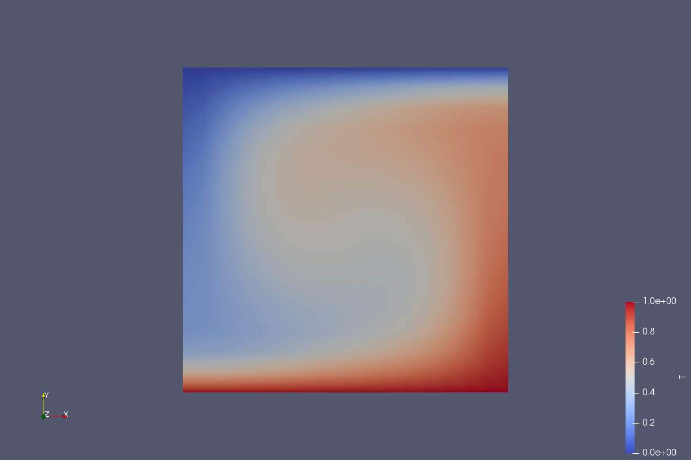
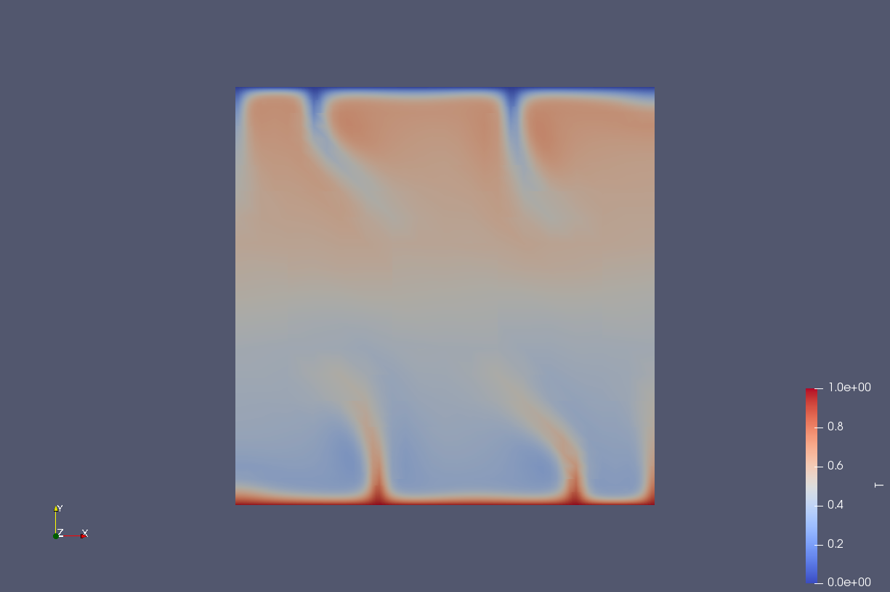

# Cours_ASPECT_M1_Geosciences

Cours/TPs pour M1 Geosciences pour découvrir le code ASPECT pour la convection mantellique. (~2h30 + projet en groupes)

Le TP a été fait à l'Université de Nantes (2019, 2021), avec ASPECT v.2.0, installé sur des machines Ubuntu 16.04. 

Fourni: 
- slides du cours (avec sources et images LaTeX)
- fichiers de paramètres pour explorer différentes valeurs du nombre de Rayleigh (10^2 à 10^7)
- notebook jupyter pour le traitement des données.

 

ASPECT (Advanced Solver for Problems in Earth's ConvecTion) https://aspect.geodynamics.org/

Lien vers le code source : https://github.com/geodynamics/aspect
